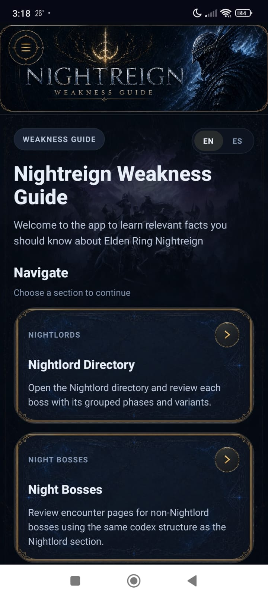
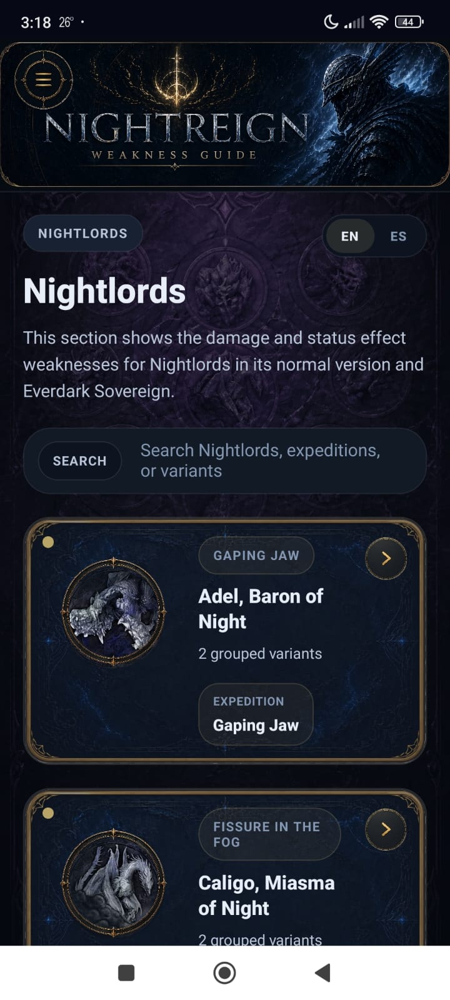
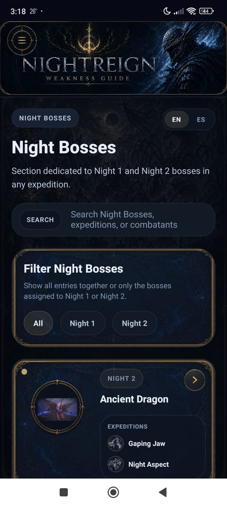
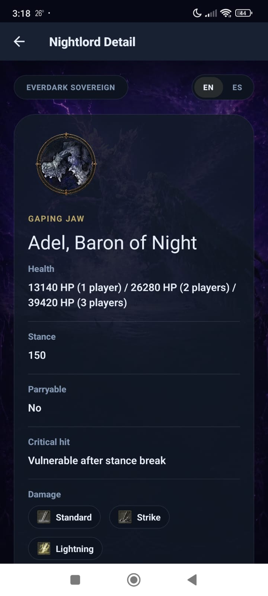
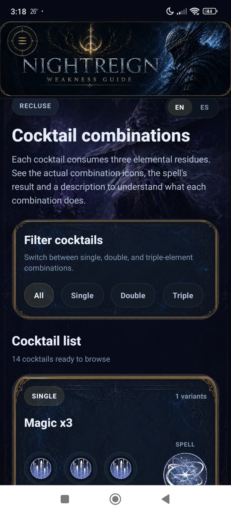

# Elden Ring Weakness Guide

[English](./README.md) | [Español](./README.es.md)

Presentación de proyecto de una app móvil enfocada en consulta rápida de debilidades de jefes, referencia de encuentros y una experiencia móvil alineada con la estética de *Elden Ring Nightreign*.

## Resumen del proyecto

*Elden Ring Weakness Guide* es una app móvil pensada para jugadores que necesitan consultar información de combate de forma rápida y legible mientras preparan o juegan una run. En lugar de depender de hojas de cálculo, notas dispersas y páginas de comunidad, la app reúne la información clave de Nightreign en una sola experiencia móvil estructurada.

Este repositorio público existe para presentar el proyecto. **No** incluye el código fuente. Su objetivo es presentar el producto, explicar cómo fue construido, mostrar la interfaz actual y ofrecer una APK instalable para Android.

## Por qué existe este proyecto

El material de referencia de Nightreign es útil, pero sus fuentes originales no están optimizadas para una consulta rápida en móvil. El proyecto reformuló ese problema como un reto de producto:

- acelerar la consulta de debilidades y encuentros
- reducir fricción al tomar decisiones durante la partida
- transformar material denso en una interfaz móvil más clara
- conservar profundidad sin conservar la complejidad de una spreadsheet

## Descarga de la APK

La app no está distribuida actualmente en Play Store.

- APK incluida en este repositorio: [`downloads/android/elden-ring-weakness-guide.apk`](./downloads/android/elden-ring-weakness-guide.apk)
- Tamaño actual de la APK: aproximadamente `80.2 MB`
- Línea oficial de publicación representada aquí: `3.0.1 / 31`

## Qué hace la app

La app permite consultar información de combate sin salir del contexto de juego para navegar entre spreadsheets, notas o páginas externas.

Integra:

- referencia de debilidades y resistencias de Nightlords
- exploración de encuentros de Night Bosses
- vistas de detalle de Nightlords con datos de combate
- información de timings de movimiento y recuperación
- referencia de objetos de Scholar
- combinaciones de cócteles de Recluse

## Mi contribución

Construí el proyecto de punta a punta:

- definición del producto
- arquitectura de información
- dirección visual de la interfaz móvil
- integración de contenido
- limpieza y transformación de datos
- empaquetado y validación de release en Android

## Cómo fue construido

El proyecto fue construido como una app móvil con Expo + React Native, TypeScript y datos JSON locales derivados de material de referencia basado en spreadsheets y fuentes curadas manualmente.

El reto principal no fue solo implementar la app, sino traducir información inconsistente, densa y parcialmente visual hacia un producto móvil más claro, con secciones buscables, vistas de detalle reutilizables y un sistema visual más fuerte.

Para un desglose más específico, revisa [docs/how-it-was-built.md](./docs/how-it-was-built.md).

## Capturas

### Inicio

### Nightlords

### Night Bosses

### Detalle de Nightlord

### Recluse

## Decisiones de producto

- Prioricé navegación mobile sobre una presentación tipo tabla densa.
- Usé identidad visual por sección para acelerar reconocimiento y navegación.
- Enfoqué la app en referencia accionable en lugar de replicar cada campo bruto del material original.
- Organicé el contenido para que la app pudiera crecer sin perder claridad.

## Contexto de release

- Línea actual de la app: `3.0.1 / 31`
- Package de Android: `nightreign.w.g`
- Objetivo del repo público: presentación del proyecto y descarga de la app
- Código fuente: intencionalmente privado

## Caso de estudio

Para una explicación breve del proyecto, revisa [docs/case-study.md](./docs/case-study.md).
